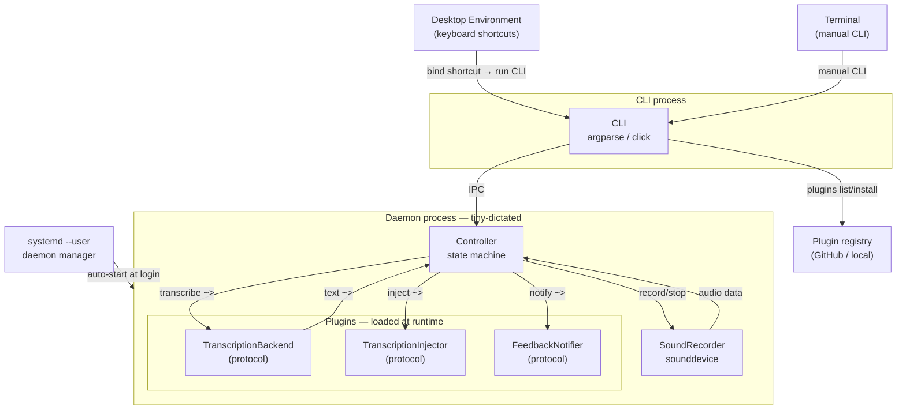

# SPECS.md

Minimal voice dictation tool for Linux (speech-to-text, STT).

## Design rules

- the tool must be integrated into the desktop environment: either using keyboard shortcuts, a system tray icon, or custom
- transcription can be done by different backends: local or remote, batch or realtime
- the tool gives feedback to the user: either via notifications, layer shell, or custom
- **plugins are external to the app core** — installed from a registry into the user config, loaded at runtime via Python Protocols

## Architecture

### Process model

Two processes:

- **Daemon** (`tiny-dictated`) — background [systemd --user service](https://wiki.archlinux.org/title/Systemd/User). Owns Controller, SoundRecorder, and the plugin system.
- **CLI** (`tiny-dictate`) — one-shot client. Sends commands to the daemon via IPC (Unix socket, eventually D-Bus).

The daemon starts at login. Keyboard shortcuts are configured in the desktop environment — they run the CLI with `start`, `stop`, `cancel` or `toggle`.

### Plugin system

All external behaviour (transcription, injection, notifications) is provided by **plugins** — Python modules with a `plugin.py` exposing a `create(config)` factory, installed into the user config directory.

**Protocols** (defined in `src/tiny_dictate/protocols.py`):

| Protocol | Factory signature |
|----------|------------------|
| `TranscriptionBackend` | `create(config) -> TranscriptionBackend` |
| `TranscriptionInjector` | `create(config) -> TranscriptionInjector` |
| `FeedbackNotifier` | `create(config) -> FeedbackNotifier` |

**Plugin loading** — looks in `~/.config/tiny-dictate/plugins/<name>/plugin.py`, imports dynamically via `importlib.util`.

**Plugin registries** — `PluginRegistry` is an abstract source of plugins with two built-in implementations:

| Registry | Dev mode | Prod mode |
|----------|----------|-----------|
| `LocalDirectoryPluginRegistry` | Symlinks from local `plugins/` directory | — |
| `GithubRepoPluginRegistry` | — | Downloads from GitHub raw content |

Auto-detection: if `plugins/` exists next to the package source, the local registry is used; otherwise it falls back to GitHub.

Users can configure a custom registry in `config.toml`:

```toml
[plugin_registry]
type = "local"
path = "/home/user/my-plugins"
# type = "github"
# repo = "my-org/my-repo"
# branch = "main"
```

**Plugin directory structure:**

```
~/.config/tiny-dictate/plugins/
├── transcription_backends/
│   └── elevenlabs/     ← symlink in dev, copy in prod
│       ├── manifest.json
│       └── plugin.py
├── transcription_injectors/
│   └── clipboard/
└── feedback_notifiers/
    └── libnotify/
```

Source plugins (project root):

```
plugins/
├── transcription_backends/
│   └── elevenlabs/
├── transcription_injectors/
│   └── clipboard/
├── feedback_notifiers/
│   └── libnotify/
└── index.json
```

Users can write their own plugins without modifying the app — just drop `plugin.py` with a `create()` factory in the right directory.

### Component diagram



**Component responsibilities:**

| Component | Process | Responsibility |
|-----------|---------|---------------|
| **CLI** | Client | Runtime commands + lifecycle + plugin management (`plugins list`, `install`, `uninstall`) |
| **Controller** | Daemon | State machine (RealtimeController / BatchController), orchestrates recording + plugin calls |
| **SoundRecorder** | Daemon | Captures audio via `sounddevice`, yields PCM int16 chunks |
| **Plugins** | Daemon | Loaded dynamically from `~/.config/tiny-dictate/plugins/` via Protocols. `create(config)` factory. |

## CLI commands

### Runtime commands

These commands require the daemon to be running. They communicate with it via D-Bus.

| Command | Arguments | Description |
|---------|-----------|-------------|
| `start` | — | Start dictation (begin recording) |
| `stop` | — | Stop dictation and transcribe |
| `cancel` | — | Cancel current dictation (discard audio) |
| `toggle` | — | Toggle between idle and recording |

### Lifecycle commands

These commands manage the daemon installation and work without a running daemon.

| Command | Arguments | Description |
|---------|-----------|-------------|
| `install` | — | Install the systemd --user service, enable and start it |
| `uninstall` | — | Stop, disable and remove the systemd --user service |
| `setup` | — | Interactive first-run wizard (configuration + install) |

### Plugin commands

| Command | Description |
|---------|-------------|
| `plugins list` | List available and installed plugins |
| `plugins install <id>` | Install a plugin (symlink in dev, download in prod) |
| `plugins uninstall <id>` | Remove an installed plugin |

Plugin IDs are just the plugin name, e.g. `elevenlabs`.

---

#### `install`

Copy bundled `tiny-dictated.service` → `~/.config/systemd/user/`, `systemctl --user daemon-reload && enable && start`. Prompts for confirmation before any destructive step.

#### `uninstall`

`systemctl --user stop && disable`, remove service file, `daemon-reload`. Prompts for confirmation.

#### `setup`

Interactive wizard (each step skippable):

1. Check prerequisites (Python, `sounddevice`, etc.)
2. Choose transcription backend + API key if needed
3. Choose injection method (clipboard + paste method, file, etc.)
4. Print keyboard shortcut instructions
5. Call `install`

Config saved to `~/.config/tiny-dictate/config.toml`.

## System tray

The system tray icon provides a right-click context menu with:

- **Start / Stop** dictation (depending on current state)
- **Cancel** current dictation
- **Microphone** → submenu listing available audio input devices
- **Quit** — stop the daemon

### Microphone selection

The **Microphone** submenu lists available PipeWire audio sources at runtime via `pw-cli list-objects` (fallback: `pactl list sources`).

Each source has a radio indicator: `●` = currently selected, `○` = available. Selecting one:

1. Switches `SoundRecorder` to the new device immediately.
2. Persists to `~/.config/tiny-dictate/config.toml` under `[audio].default_source`.

```toml
[audio]
default_source = "alsa_input.usb-...analog-stereo"
```

## State machines

Four states: **Idle**, **Recording**, **Transcribing**, **Error**.

### Batch mode (linear)

`Idle` → `Recording` (start) → `Transcribing` (stop) → `Idle` (success).

- `Recording` → `Idle` : cancel
- `Recording` → `Error` : recording failed
- `Transcribing` → `Error` : transcription / injection failed
- `Error` → `Idle` : acknowledged

### Realtime mode (chunk loop)

`Recording ↔ Transcribing` alternates per audio chunk until user stops.

- `Recording` → `Transcribing` : chunk ready
- `Transcribing` → `Recording` : chunk done, back to capturing
- `Recording` / `Transcribing` → `Idle` : user stops (finishes pending transcription)
- Same error transitions as batch

### Notifications

All use a fixed notification ID to replace each other in history.

| Transition | Shown | Cleared |
|------------|-------|---------|
| `Idle → Recording` | 🎤 Recording… | — |
| `Recording → Idle` (cancel) | — | 🎤 Recording… |
| `Recording → Transcribing` | ⏳ Transcribing… (replaces 🎤) | — |
| `Transcribing → Recording` (realtime) | 🎤 Recording… (replaces ⏳) | — |
| `Transcribing → Idle` | — | ⏳ Transcribing… |
| `→ Error` | ❌ (Recording / Transcription) failed | — |
| `Error → Idle` | — | ❌ notification |

### Errors

| Error | Cause |
|-------|-------|
| Recording failed | Microphone unavailable, device error |
| Transcription failed | Backend unreachable, invalid audio, quota exceeded |
| Injection failed | Clipboard inaccessible, file unwritable |

## Transcription injection

When the transcription text result is obtained from the transcription backend, it must be injected in the user environment, either:

- by copying it to the clipboard, and optionnally pasting the clipboard
- by writing it to a file
- by any other custom way

Pasting the clipboard can be done several ways (ctrl-v, ctrl-shift-v, shift-insert), depending on the focused window.

## Technologies

- written in Python
- uses `sounddevice` for audio recording
